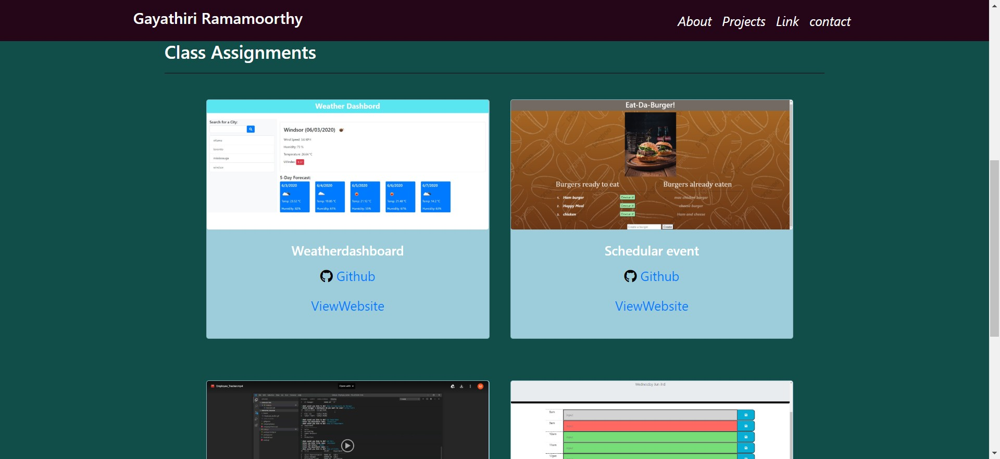

# portfolio_2

###  WEb URL:

https://mathigayathri2001.github.io/portfolio_2/

## Badges

## Table of Contents
   * [Description](#description)
   * [Built with](#built-with)
   * [Badges](#badges)
   * [License](#license)
   * [Visuals](#visuals)

## Description

This project describes about my portfolio, skills learned in the course, resume, linkedin and github link related to all my group projects and class assignments. This porfolio will help me to go to the job market as full stack web developer.

## Built with
* Html
* Bootstrap css

## Visuals

## License

https://github.com/mathigayathri2001

  
